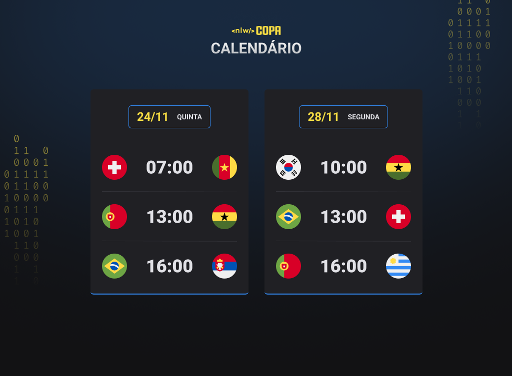

<h1 align="center"> ⚽ NLW Copa do Mundo </h1>

Projeto realizado durante o evento NLW promovido pela Rocketseat.

 

  <a href="#-tecnologias">Tecnologias</a>&nbsp;&nbsp;&nbsp;|&nbsp;&nbsp;&nbsp;
  <a href="#-projeto">Sobre o projeto</a>&nbsp;&nbsp;&nbsp;|&nbsp;&nbsp;&nbsp;
  <a href="#-layout">Layout</a>&nbsp;&nbsp;&nbsp;|&nbsp;&nbsp;&nbsp;
  <a href="#-aprendizados">Aprendizados</a>&nbsp;&nbsp;&nbsp;&nbsp;&nbsp;&nbsp;

 

  

  

## 🚀 Tecnologias

 

- HTML e CSS
- JavaScript
- Git e Github

 

## 💻 Projeto

O projeto consiste em um calendário que mostra a data e o horário dos jogos que serão realizados durante a Fase de grupos da Copa do Mundo 2022.
  
Você pode visualizar o projeto [CLICANDO AQUI!](https://jvinicius-ribeiro.github.io/nlw-copa/)

 

## 🔖 Layout

Quer construir um calendário da Copa e testar suas habilidades em Front-end também?   
Você pode visualizar o layout do projeto através [DESSE LINK](https://www.figma.com/file/J1Z33MISC22YZB8wfxiIns/NLW-Copa-Explorer/duplicate). É necessário ter conta no [Figma](https://figma.com) para acessá-lo.

 

## 🏆 Aprendizados

A realização desse projeto foi enriquecedora do começo ao fim. Pude reforçar uma boa parte de todo conteúdo que já havia aprendido durante meus estudos em <b>HTML, CSS e JavaScript.</b> Além disso, foi importante praticar boas práticas para refatorar meu código, usando cleancode e tornando-o mais responsivo tanto para dispositivos mobile quanto desktops. 

  

  <h2>👋 <u>Contato</u></h2> 
  

  
  

  

<h3 align="center">Obrigado pela sua visita! Estou aberto à sugestões e feedbacks =)</h3>

